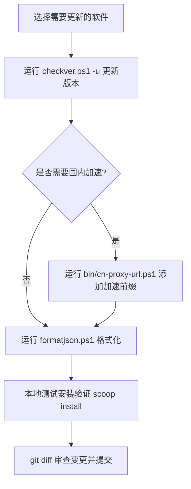

# 仓库维护与更新指南

本文档介绍 `bin/` 目录下的维护脚本，用于管理和维护本 Scoop bucket 中的软件清单（Manifest），包括版本检查、自动更新、格式化以及忽略规则维护。

---

## 目录

- [脚本概览](#脚本概览)
- [前置要求](#前置要求)
- [checkver.ps1 - 软件版本检测与自动更新](#checkverps1---软件版本检测与自动更新)
- [missing-checkver.ps1 - 缺失版本检查排查](#missing-checkverps1---缺失版本检查排查)
- [formatjson.ps1 - Manifest 规范化格式化](#formatjsonps1---manifest-规范化格式化)
- [update-gitignore.ps1 - 归档与废弃规则维护](#update-gitignoreps1---归档与废弃规则维护)
- [日常维护推荐工作流](#日常维护推荐工作流)
- [常见问题与排查](#常见问题与排查)

---

## 脚本概览

| 脚本 | 作用 | 调用依赖 |
| :--- | :--- | :--- |
| `bin/checkver.ps1` | 检查上游最新版本；支持自动下载新版本、更新 Hash 及写入 Manifest | Scoop 核心 `checkver.ps1` |
| `bin/missing-checkver.ps1` | 扫描并列出当前 `bucket/` 下缺少 `checkver` 自动更新配置的软件 | Scoop 核心 `missing-checkver.ps1` |
| `bin/formatjson.ps1` | 统一格式化 Manifest JSON 文件（规范缩进、字段顺序） | Scoop 核心 `formatjson.ps1` |
| `bin/update-gitignore.ps1` | 同步 `archive/` 与 `deprecated/` 下的软件至根目录 `.gitignore` | 本地独立脚本 |
| `bin/cn-proxy-url.ps1` | 修改软件包 Manifest 中的下载 URL，添加/移除国内加速前缀 | 本地独立脚本 |
| `bin/cn-proxy-git.ps1` | 修改 bucket 与 scoop 的 Git 远端地址，添加/移除国内加速前缀 | 本地独立脚本 |

---

## 前置要求

1. **已安装 Scoop**：
   `checkver.ps1`、`missing-checkver.ps1` 与 `formatjson.ps1` 会自动调用 Scoop 自身的内置脚本。脚本执行时会自动寻找 `$env:SCOOP_HOME` 或通过 `scoop prefix scoop` 定位安装路径。
2. **PowerShell 执行权限**：
   确保执行策略允许运行脚本：
   ```powershell
   Set-ExecutionPolicy -ExecutionPolicy RemoteSigned -Scope CurrentUser
   ```
3. **工作目录**：
   建议在仓库根目录下打开 PowerShell 执行以下命令。

---

## checkver.ps1 - 软件版本检测与自动更新

用于检测 `bucket/` 目录下软件包的上游最新版本，并在指定参数时自动拉取新哈希并更新 Manifest。

### 基本用法

```powershell
# 1. 检查指定软件是否有新版本（仅检测，不修改文件）
.\bin\checkver.ps1 <软件名>

# 2. 检查并自动更新指定软件的 Manifest（更新版本号、URL 及 SHA256 哈希）
.\bin\checkver.ps1 <软件名> -u

# 3. 检查所有软件的新版本（用时较长）
.\bin\checkver.ps1 *

# 4. 强制更新指定软件（即使检测到版本号相同也重新计算哈希并更新）
.\bin\checkver.ps1 <软件名> -f -u
```

### 常用参数说明

| 参数 | 别名 | 说明 |
| :--- | :--- | :--- |
| `<app>` | - | 软件名称（对应 `bucket/<app>.json`，不含扩展名），支持通配符 `*` |
| `-u` | `-Update` | 自动更新模式。检测到新版本时，自动下载或抓取对应文件计算 Hash 并写回 Manifest |
| `-f` | `-Force` | 强制模式。即使版本号未发生变动，也强制重新执行 `autoupdate` 逻辑 |
| `-d <dir>` | `-Dir` | 指定检测的目录（脚本内部默认指向 `../bucket`） |
| `-k` | `-SkipHash` | 更新 Manifest 时跳过哈希校验下载（不推荐，仅用于测试） |

### 示例

```powershell
# 检查 7zip 最新版本
.\bin\checkver.ps1 7zip

# 检查并更新 uv 到最新版本
.\bin\checkver.ps1 uv -u

# 批量检查所有软件版本
.\bin\checkver.ps1 *
```

> [!TIP]
> 自动更新成功后，建议配合 `git diff` 检查更新内容（版本号、URL、Hash 是否正确），并进行本地安装测试。

---

## missing-checkver.ps1 - 缺失版本检查排查

用于排查 `bucket/` 目录中哪些 Manifest 还没有配置 `checkver` 字段，方便维护者补充自动化更新规则。

### 基本用法

```powershell
# 列出 bucket 下所有未配置 checkver 的软件
.\bin\missing-checkver.ps1
```

### 输出说明

- 脚本会遍历 `bucket/` 目录下的所有 `.json` 文件。
- 逐个校验是否包含有效 `checkver` 节点。
- 最终输出所有缺失该配置的软件清单，便于集中补充或排查哪些软件属于手动维护的固定版本。

---

## formatjson.ps1 - Manifest 规范化格式化

Scoop 官方对 Manifest JSON 文件的缩进、字段次序（如 `version`、`description`、`homepage`、`license` 等）有严格的代码规范。`formatjson.ps1` 可自动按照官方标准整理 JSON 文件。

### 基本用法

```powershell
# 格式化 bucket 目录下的所有 Manifest 文件
.\bin\formatjson.ps1

# 格式化指定 Manifest 文件
.\bin\formatjson.ps1 <软件名>.json
```

### 作用

1. 统一采用 4 空格缩进。
2. 按照 Scoop 官方约定的标准属性顺序排序顶层字段。
3. 清理多余空行与不规范的空白字符，保证 Git diff 简洁清晰。

---

## update-gitignore.ps1 - 归档与废弃规则维护

本仓库采用版本归档策略：
- `bucket/`：存放当前主力维护的最新软件版本。
- `archive/`：存放历史旧版本或特殊需求锁定的版本。
- `deprecated/`：存放已废弃或停止维护的软件。

为防止在切换、测试或多版本并存时不慎将归档/废弃版本直接提交覆盖到 `bucket/`，本脚本会自动收集并在根目录 `.gitignore` 中生成忽略规则。

### 基本用法

```powershell
.\bin\update-gitignore.ps1
```

### 执行逻辑

1. 读取 `archive/` 与 `deprecated/` 目录下的所有 `.json` 文件。
2. 生成对应的 `/bucket/<filename>.json` 忽略模式。
3. 读取现有的 `.gitignore`，自动增量添加新增条目、清理无效条目，并保留非 `/bucket/` 的原有规则。
4. 在控制台输出详细的变更统计（总条目数、新增数、移除数）。

---

## 日常维护推荐工作流

日常进行软件版本维护时的标准操作流程如下：



### 步骤分解

1. **检测并更新版本**：
   ```powershell
   .\bin\checkver.ps1 <软件名> -u
   ```
2. **（可选）添加国内加速代理前缀**：
   若该软件在国内网络环境下下载缓慢，可添加代理前缀（详见 [加速前缀脚本](cn-proxy.md)）：
   ```powershell
   .\bin\cn-proxy-url.ps1 <软件名>
   ```
3. **格式化 Manifest**：
   ```powershell
   .\bin\formatjson.ps1
   ```
4. **本地安装验证**：
   ```powershell
   # 卸载旧版（若已安装）并测试安装修改后的本地 Manifest
   scoop install .\bucket\<软件名>.json
   ```
5. **归档处理（如适用）**：
   如果将旧版移入了 `archive/` 目录，执行规则同步：
   ```powershell
   .\bin\update-gitignore.ps1
   ```
6. **提交变更**：
   ```powershell
   git status
   git diff
   git add bucket/<软件名>.json
   git commit -m "feat(<软件名>): update to <新版本号>"
   ```

---

## 常见问题与排查

### 1. 运行提示找不到 Scoop 核心脚本

- **现象**：提示 `Cannot find path ... checkver.ps1` 或 `$env:SCOOP_HOME` 为空。
- **排查与解决**：
  检查当前用户是否正常安装了 Scoop：
  ```powershell
  scoop prefix scoop
  ```
  如果返回空，可手动为当前终端指定环境变量：
  ```powershell
  $env:SCOOP_HOME = "$env:USERPROFILE\scoop\apps\scoop\current"
  ```

### 2. checkver 检测 GitHub Release 超时或报 403 (API Rate Limit)

- **现象**：访问 GitHub API 时频繁失败或提示超出配额。
- **解决办法**：
  为 Scoop 配置 GitHub API Token 或终端代理：
  ```powershell
  # 配置 GitHub API Token（无需任何权限的个人访问令牌即可大幅提升请求额度）
  scoop config gh_token "your_github_token_here"

  # 或在 PowerShell 中开启代理
  $env:HTTP_PROXY = "http://127.0.0.1:7890"
  $env:HTTPS_PROXY = "http://127.0.0.1:7890"
  ```

### 3. checkver 成功但下载计算 Hash 失败

- **原因**：上游 release 资源暂未完全上传完毕，或者文件名规则变动导致匹配的下载 URL 404。
- **排查**：
  检查 Manifest 中的 `autoupdate.url` 规则是否匹配上游新版本的资源文件名命名方式。
